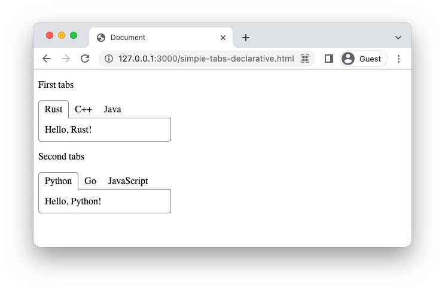

# simple-tabs

A declarative HTML/CSS/JavaScript tabs implementation that minimizes boilerplate.



## Usage

There are two ways to make tabs: regular and declarative. The regular requires users to explicitly insert and style tab HTML elements. The declarative enables users to describe tabs with minimal boilerplate and then call a JavaScript function to insert and style tab HTML elements automatically.

The regular and declarative examples below result in the identical DOM tree in the browser:

### Regular

1. Link the stylesheet `simple-tabs.css` in `<head>`
2. Wrap tab buttons in `<div>` with `tab-button` class
3. Wrap tab contents in `<div>` with `tab-content` class
4. Wrap both the buttons and contents of each tab group in a `<div>` with `simple-tabs` class
5. Include the script `simple-tabs.js` at the end of `<body>`
6. Call `initSimpleTabs()` to attach DOM event listeners

```html
<head>
  <link href="simple-tabs.css" rel="stylesheet">
</head>

<body>
  <p>First tabs</p>
  <div class="simple-tabs">
    <div class="tab-button">Rust</div><div class="tab-button">Java</div><div class="tab-button">C++</div>
    <div class="tab-content">Hello, Rust!</div>
    <div class="tab-content">Hello, C++!</div>
    <div class="tab-content">Hello, Java!</div>
  </div>

  <p>Second tabs</p>
  <div class="simple-tabs">
    <div class="tab-button">Python</div><div class="tab-button">Go</div><div class="tab-button">JavaScript</div>
    <div class="tab-content">Hello, Python!</div>
    <div class="tab-content">Hello, Go!</div>
    <div class="tab-content">Hello, JavaScript!</div>
  </div>

  <script src="simple-tabs.js"></script>
  <script>initSimpleTabs();</script>
</body>
```

### Declarative

1. Link the stylesheet `simple-tabs.css` in `<head>`
2. Wrap tab contents in `<div>` with a `data-tab={label}` attribute 
3. Wrap the contents of each tab group in a `<div>`
4. Include the script `simple-tabs.js` at the end of `<body>`
5. Call `initSimpleTabsDeclarative()` to generate tab HTML elements and attach DOM event listeners

```html
<head>
  <link href="simple-tabs.css" rel="stylesheet">
</head>

<body>
  <p>First tabs</p>
  <div>
    <div data-tab="Rust">Hello, Rust!</div>
    <div data-tab="Java">Hello, Java!</div>
    <div data-tab="C++">Hello, C++!</div>
  </div>

  <p>Second tabs</p>
  <div>
    <div data-tab="Python">Hello, Python!</div>
    <div data-tab="Go">Hello, Go!</div>
    <div data-tab="JavaScript">Hello, JavaScript!</div>
  </div>

  <script src="simple-tabs.js"></script>
  <script>initSimpleTabsDeclarative();</script>
</body>
```